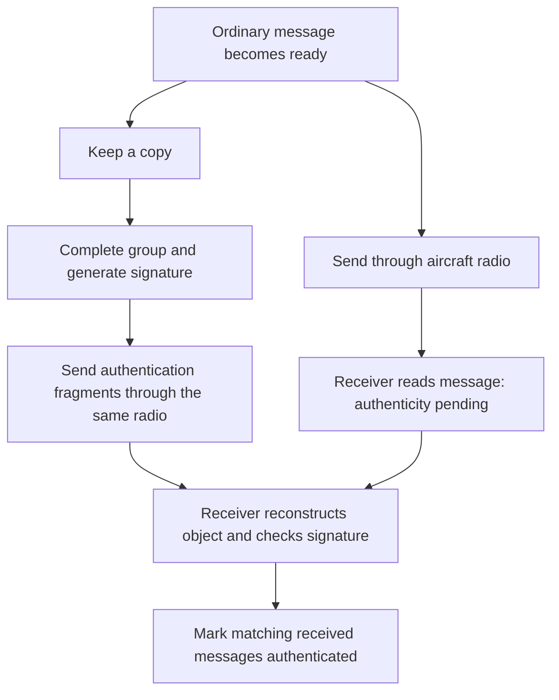

# Supervisor meeting guide: the ADS-B authentication experiment

**Plain-language guide to the repository as reviewed on 8 October 2026.**

Start with the short script in Section 1 and the ten-minute meeting schedule in Section 13. Sections 2–5 explain the system, Sections 6–9 provide commands, and Sections 10–12 are a searchable question-and-answer reference. This is a preparation document; you do not need to present every page or read every command aloud.

**Status to state at the meeting:** the implementation and small demonstration have been tested. The two final one-hour datasets, their acquisition adapter, and the final paper results are still pending. The repository cleanup and this guide must be included in a published commit before an external reader can clone this exact version. Local changes are not automatically on GitHub.

## Contents

1. [The explanation to give first](#1-the-explanation-to-give-first)
2. [One message, from creation to authentication](#2-one-message-from-creation-to-authentication)
3. [The repository: what every part is for](#3-the-repository-what-every-part-is-for)
4. [What happens when we run the program](#4-what-happens-when-we-run-the-program)
5. [What we compare and measure](#5-what-we-compare-and-measure)
6. [From a fresh clone to a working demonstration](#6-from-a-fresh-clone-to-a-working-demonstration)
7. [From real data to the full experiment](#7-from-real-data-to-the-full-experiment)
8. [Reproducing the exact numbers in a published result](#8-reproducing-the-exact-numbers-in-a-published-result)
9. [Reproducing the older work](#9-reproducing-the-older-work)
10. [Supervisor questions: method and realism](#10-supervisor-questions-method-and-realism)
11. [Supervisor questions: computers, timing, and SLH-DSA](#11-supervisor-questions-computers-timing-and-slh-dsa)
12. [Supervisor questions: security and evidence](#12-supervisor-questions-security-and-evidence)
13. [A suggested meeting walkthrough and next decisions](#13-a-suggested-meeting-walkthrough-and-next-decisions)

## 1. The explanation to give first

You can say:

> “We want to find out what happens if aircraft add digital signatures to ADS-B messages. We take recorded traffic, create real signatures for either individual messages or groups of messages, and simulate sending those signatures as extra small radio transmissions. We then measure whether ordinary messages are affected, how long authentication takes, how much traffic gets authenticated, and whether the modeled computers can keep up.
>
> “Receiving a message and authenticating it are separate events. A receiver can read the ordinary message first and check its authenticity later. Our experiment measures both clocks.
>
> “The software has been validated on small inputs. We still need the final real datasets before reporting the paper’s main results.”

There are three central questions:

| Question | What it means in everyday language |
| --- | --- |
| Can the radio channel cope? | Do the extra transmissions interfere with ordinary traffic, and how much radio time do they require? |
| Can the computers cope? | Can each aircraft make signatures and the receiver check them fast enough to avoid an ever-growing queue? |
| Is authentication timely and sufficiently complete? | How many messages are authenticated, and how old are they when that happens? |

A few words used throughout the repo:

| Word | Plain-language meaning |
| --- | --- |
| Trace | A list of recorded messages or transmissions with their times. |
| Signature | A mathematical proof checked against a message and a public key. It does not hide the message or replace its contents. |
| Fragment | One small piece of a larger authentication object. |
| Replay | A computer simulation that processes the recorded events in time order under chosen assumptions. No radio transmission is performed by these commands. |
| Scenario | One choice of experimental settings. |
| Workload | The actual signed groups for one algorithm, group size, and dataset. |
| Cache | Saved work that can be checked and reused instead of recomputed. |
| Manifest / provenance | A record of what files, settings, and software produced an artifact. |
| Hash | A fingerprint of a file’s contents, used to detect changes. It does not establish that the original data were truthful. |

## 2. One message, from creation to authentication

Imagine an aircraft announces its position. The ordinary position message goes out through its radio. At the same time, the aircraft keeps a copy for authentication.

The signature is too large for the small payload considered here. The aircraft therefore sends an authentication object in multiple additional frames. The receiver keeps the original message, collects those pieces, and checks the signature when it has everything required.



If the diagram is not rendered, read it as two parallel paths: **ordinary message → reception**, and **retained copy → signing → fragments → verification**.

### Per-message versus grouped authentication

- With **`k=1`**, each message has its own signature. Signing can start once that message exists and the signer is available.
- With **`k=5`**, one signature covers five messages from the same aircraft. Signing can start once the fifth exists and the signer is available.
- The other selected group sizes are **10 and 20**.

For example, if five messages become ready at times 0, 1, 2, 3, and 4 seconds, all five can proceed to ordinary transmission at their respective times. The group only becomes ready for signing at 4 seconds. The first member has already accumulated four seconds of grouping delay before signing even starts.

**Having all message data ready before signing does not mean keeping those messages unsent.** We sign retained copies. This is what “detached authentication” means in this experiment.

A signature is checked against the exact original bytes; the receiver cannot recover a missing original simply by reading its signature. For grouped authentication, missing one required original can prevent authenticating the whole group.

### The four times we distinguish

| Time | Meaning |
| --- | --- |
| `t0` | Recorded time used as the message’s availability reference. |
| `t_tx` | When its modeled radio transmission starts. |
| `t_rx` | When the receiver successfully receives that ordinary frame. |
| `t_auth` | When successful verification finishes. |

**Added ordinary transmission delay:** `t_tx − t0`.

**Authentication delay after reception:** `t_auth − t_rx`.

These answer different questions. A message might be received quickly but remain unauthenticated for a long time. A lost ordinary message has no successful reception time.

The original capture supplies observation times, not onboard sensor measurement times. Consequently, this experiment estimates added delay under its model; it does not measure the aircraft’s complete sensor-to-transmission latency.

## 3. The repository: what every part is for

The simplest way to navigate it is: **settings → inputs → software → outputs**. Documentation and tests explain and check that process.

### The seven main folders

| Folder | ELI5 description | What to open during the meeting |
| --- | --- | --- |
| [`config/`](../config/README.md) | The experiment’s recipes: what to run and which assumptions to use. | `demo.json`, `full_window_a.json`, `signed_replay_scenarios.json`. |
| [`data/`](../data/README.md) | The ingredients: input messages, channel events, and data descriptions. | `demo/` now; `full/` when real inputs exist. |
| [`src/`](../src/) | The machinery that prepares data, signs, simulates, and plots. | `pipeline.py` and the `experiment/` files described below. |
| [`scripts/`](../scripts/) | Helpers for installation and checking reproduction. | `check_demo.py`, `compare_signed_results.py`. |
| [`tests/`](../tests/) | Automatic checks that the machinery behaves as intended. | Tests for cryptography, fragments, queues, collisions, and file integrity. |
| [`docs/`](README.md) | Instructions, explanations, manuscript material, and historical notes. | This guide, `methodology.md`, and `reproduction_commands.md`. |
| [`results/`](../results/README.md) | The output evidence: new runs, frozen reference results, and preserved earlier work. | `runs/demo/` and `reference/development/`. |

### Where the different datasets and results belong

```text
config/
  demo.json                         Small current-method demonstration
  full_window_a.json                First real one-hour window
  full_window_b.json                Second real one-hour window
  signed_replay_scenarios.json       Current experimental settings
  algorithms.json                   Actual cryptographic backends
  hardware_profiles.json            Modeled processing times and sources
  requirements/                     Pinned Python dependency versions

data/
  demo/                             Synthetic implementation fixture
  development/raw/                  Original short recorded sample
  development/manifest.json          Sample hashes and known/unknown provenance
  development/processed/             Preserved legacy derived inputs
  calibration/                      Size calibration for the older model
  full/window_a/raw/                Future target capture and channel file
  full/window_b/raw/                Future target capture and channel file

results/
  runs/demo/                        New small demonstration outputs
  runs/full/window_a/               Future real experiment outputs
  runs/full/window_b/               Future real experiment outputs
  runs/development/                 Reproduction of the older experiment
  reference/development/            Frozen historical reports and figures
  development/                      Legacy metadata and recovery state
  archive/local_runs/               Preserved local work from before cleanup
```

Directories under `data/full/` and `results/runs/` are created when needed. Their absence from a fresh clone is expected. Large/generated local files are normally ignored by Git.

**Inputs belong in `data/`; newly generated outputs belong in `results/runs/`.** The old `data/development/processed/` directory is a deliberate exception retained for legacy signing recovery.

### What the configuration files mean

| File | Role |
| --- | --- |
| `demo.json` | Run the current method on a tiny synthetic dataset. |
| `full_window_a.json`, `full_window_b.json` | Run the current method on the two real windows once supplied. |
| `full.json` | Compatibility alias for window A. It does **not** run both windows. |
| `signed_replay_scenarios.json` | Current grouping, pacing, channel, follow-up, and queue settings. |
| `algorithms.json` | Four enabled algorithms and the implementations that actually execute. |
| `hardware_profiles.json` | Published reference timings and explicitly labeled timing assumptions. |
| `development.json`, `delayed_replay_scenarios.json` | The older 64-case development experiment. |
| `development_recovery.json` | Legacy exhaustive signing and recovery paths. |
| `replay_scenarios.json` | The earliest deadline-based model, retained for audit. |

Paths inside these files are relative to the repository root. A modern configuration declares a `run_directory`; its generated files must remain inside that directory. A lock prevents two pipeline writers from using the same run simultaneously.

### What the code does

You do not need to explain individual functions. Use this map if a supervisor asks where something is implemented.

| Location | Job |
| --- | --- |
| [`src/pipeline.py`](../src/pipeline.py) | Reads the chosen recipe, runs its steps, and checks whether saved inputs/results can be reused. |
| [`src/runtime.py`](../src/runtime.py) | Writes files safely and manages run locks. |
| `src/analysis/analyze_capture.py` | Describes the capture: record types, counts, and timing. |
| `src/analysis/analyze_aircraft.py` | Describes aircraft activity. |
| `src/analysis/analyze_duplicates.py` | Examines repeated contents without automatically deleting them. |
| `src/processing/preprocess_capture.py` | Selects target records, sorts them, assigns IDs, and records raw/processed hashes. |
| `src/crypto/` | Actual ECDSA, ML-DSA, Falcon, and SLH-DSA signing/verification adapters. `common.py` holds shared helpers. |
| [`src/experiment/signed_experiment.py`](../src/experiment/signed_experiment.py) | Coordinates the current combinations of algorithm, group size, pacing, and channel. |
| [`src/experiment/signed_workload.py`](../src/experiment/signed_workload.py) | Creates real signed groups; stores public keys and signed bytes; verifies cached objects on reuse. |
| [`src/experiment/replay_transport.py`](../src/experiment/replay_transport.py) | Defines what is signed, how objects are split into fragments, and how a receiver reconstructs and associates them. |
| [`src/experiment/signed_replay.py`](../src/experiment/signed_replay.py) | Models event timing, aircraft signing, radio waiting, reception, and verification queues. |
| `src/experiment/channel_trace.py` | Loads and validates the recorded channel events and target links. |
| `src/experiment/shared_channel.py` | Applies the modeled channel and overlap effects. |
| `src/experiment/hardware_profiles.py` | Loads reference processing times and their provenance. |
| `src/experiment/delayed_metrics.py` | Summarizes authentication coverage and delays. |
| `src/experiment/plot_signed_replay.py` | Exports figures for the current signed experiment. |

The remaining experiment modules retain earlier methods, and several also supply shared helpers to the current method:

| Earlier/shared code | Why it remains |
| --- | --- |
| `replay_simulator.py`, `delayed_replay.py` | Earlier simulators plus shared grouping, scheduling, and scenario helpers. |
| `replay_experiment.py` | Earlier experiment driver plus shared report/provenance helpers. |
| `generate_signatures.py` | Legacy resumable signing and metadata generation, plus shared crypto/hash helpers. |
| `operational_feasibility.py`, `constraint_screening.py` | Earlier analytical calculations; some loading helpers are shared. |
| `src/processing/build_authentication_groups.py` | Exports groups for the older workflow. |
| `plot_delayed_replay.py`, `plot_replay.py` | Figures for earlier models. |

Therefore, an old-looking filename is not proof that a file is unused or safe to delete. Files called `__init__.py` are Python package markers, not additional experiments.

### The helper scripts

| Script | Plain-language purpose |
| --- | --- |
| `scripts/bootstrap_liboqs.sh` | Build/check the pinned native post-quantum cryptographic library. |
| `scripts/check_demo.py` | Check the small current demo, including its actual saved signatures. |
| `scripts/check_reproduction.py` | Compare the older development experiment with its frozen reference. |
| `scripts/compare_signed_results.py` | Compare a current signed replay with a preserved reference, allowing different checkout locations. Cryptographic validation is a separate preceding step. |

### Documentation, tests, and miscellaneous files

The [documentation index](README.md) links to the method, command walkthrough, hardware references, channel schema, publication requirements, and old results. `docs/paper/` contains editable methodology text and its bibliography alongside the initial incomplete PDFs and planning notes. `docs/archive/` contains superseded designs and audits; its commands are historical.

Tests are organized by the component they check. For example, `test_crypto.py` checks the four real algorithms; transport tests check fragment/reassembly behavior; replay tests check scheduling, loss, and pending work; pipeline/comparison tests check input and result integrity. Test helpers such as `inspect_signature.py` are inspection utilities, not required experiment stages.

| File or hidden folder | Purpose |
| --- | --- |
| Root `README.md` | Main starting point with runnable instructions. |
| `requirements.txt` | Includes both pinned dependency lists from `config/requirements/`. |
| `pyproject.toml` | Python package metadata. Its broader minimum version does not replace the pinned Python 3.13 instructions. |
| `LICENSE` | Software license; third-party data have separate terms. |
| `.gitignore` | Excludes generated files, large local data, private recovery state, and local environments from normal commits. |
| `.gitattributes` | Preserves expected line endings and data bytes so hashes remain meaningful. |
| `.github/workflows/tests.yml` | Automatic GitHub checks: a replay-only job and a native cryptography/demo job. |
| `.git/` | Version history. |
| `.venv/` | This checkout’s Python environment. |
| `.deps/` | Local native library source/build/install created by the bootstrap. |
| `__pycache__/`, `.DS_Store` | Incidental Python/macOS files, not scientific evidence. |

## 4. What happens when we run the program

The main command is:

```bash
python -m src.pipeline --config config/demo.json
```

Read it as: **“Use this Python environment to run the project’s pipeline, following the demo recipe.”**

The current recipe has five named stages:

| Stage printed by the pipeline | What happens |
| --- | --- |
| `capture` | Describe what is in the input capture. |
| `aircraft` | Describe aircraft activity in it. |
| `duplicates` | Describe repeated message contents. |
| `preprocess` | Retain usable DF17 target messages, preserve repetitions, sort, assign trace IDs, and write hashes. |
| `replay` | Form groups, generate/check real signatures, simulate the scenarios, and write results. |

**Current signing happens inside `replay`.** The separate `--stage signatures` command belongs to the legacy workflow and is not an extra step required for the current experiment. Plotting is a later, separate command.

Inside the current replay stage:

1. Validate target/channel alignment, recording coverage, settings, and timing profiles.
2. Select one algorithm and one group size.
3. Group each aircraft’s messages independently.
4. Generate its real keys and signatures, or verify an existing matching public cache.
5. Reuse those exact signed objects across the six pacing/channel combinations.
6. Simulate when signing finishes, fragments transmit, ordinary frames arrive, and verification finishes.
7. Record successes, failures, pending work, radio demand, and delays.
8. Repeat for the remaining algorithms and group sizes; save the complete report locally.

The host can prepare signatures before running the time simulation because the entire trace is already available offline. **The simulated aircraft cannot use a signature early:** the event model releases it only after its messages exist and its modeled signing queue/service have completed.

This is why we can generate real cryptographic objects while keeping their simulated timing independent of how quickly the host computer runs Python.

## 5. What we compare and measure

### What is real and what is simulated?

| Component | Treatment |
| --- | --- |
| Message bytes/times | Recorded inputs in the real study; explicitly synthetic in the demo. |
| Keys, signatures, signature lengths | Real cryptographic operations and actual output bytes. |
| Fragmentation, reassembly, cryptographic checks | Executed on actual encoded objects. |
| Aircraft/receiver processing time | Simulated using selected reference profiles. |
| Shared radio scheduling and processor queues | Simulated. |
| Collisions and reception outcomes | Simulated under declared channel assumptions. |
| Antennas, aircraft installation, real RF transmission | Not part of this software experiment. |

### The algorithms and combinations

The implementation selects these backends in [algorithms.json](../config/algorithms.json):

| Algorithm | Role / signature size in this implementation |
| --- | --- |
| ECDSA P-256 | Classical comparison; fixed 64-byte signature encoding. |
| ML-DSA-44 | Post-quantum candidate; 2,420 bytes. |
| Falcon-512 | Post-quantum candidate; actual variable lengths are measured. |
| SLH-DSA-SHA2-128s | Post-quantum candidate; 7,856 bytes. |

The historical code label `FN-DSA-512` actually loads **Falcon-512**. Use that implementation name when explaining what was tested.

These parameter sets do not all represent the same security category. This is a comparison of the stated configurations, not an equal-security ranking of entire algorithm families. The [methodology](methodology.md#real-signatures-and-exact-count-grouping) records that qualification.

For each window, we combine:

```text
4 algorithms × 4 group sizes × 3 fragment rates × 2 channel settings
= 96 replay cases

2 recorded windows × 96 cases
= 192 cases for the final study
```

The group sizes are 1, 5, 10, and 20. Fragment rates are 10, 50, and 100 frames per second per aircraft. The channel settings are collision-free and destructive overlap.

Only **16 signed workloads per window** are needed: four algorithms × four group sizes. Each is reused for six replay cases. For two windows, that is 32 workloads, not 192 complete resignings.

### The three schedules used to assess radio effects

| Schedule | Purpose |
| --- | --- |
| Recorded ordinary-traffic baseline | What the modeled channel receives without the added authentication system. |
| Ordinary traffic plus authentication fragments | What changes when we add the system and share the aircraft radio. |
| Timing-matched control | Keep the altered ordinary transmission times but remove the fragments, to isolate fragment interference. |

These comparisons are performed within the cases; they are not three extra factors in the 192-case calculation. Each target’s recorded event is replaced by its modeled event when appropriate, so the same original is not counted twice.

### What the outputs tell us

| Question | Where to look in a result row |
| --- | --- |
| Did ordinary messages arrive? | `baseline_original_received_fraction`, `augmented_original_received_fraction`. |
| Did originals wait longer to transmit? | `ordinary_transmission_delay_ms_p50`, `_p95`, `_max`. |
| How much RF loss was attributable to fragments? | `authentication_only_additional_rf_loss_fraction`, using the timing-matched control. |
| How much extra radio demand was emitted? | `additional_offered_airtime_load`, plus required/emitted frame and airtime fields. |
| How much of all target traffic was authenticated? | `authenticated_source_fraction`. |
| How much of the received target traffic was authenticated? | `authenticated_received_fraction`. |
| How long did successful authentication take? | `receipt_to_auth_ms_p50`, `_p95`, and other delay summaries. |
| How much was authenticated within a chosen time? | `threshold_coverage`, including the denominator and excluded counts for each threshold. |
| What never finished by the cutoff? | `unresolved_messages`, received-pending counts, and queue/stage summaries. |

“p50” means median. “p95” means 95% of the observations contributing to that statistic are at or below that value. **Authentication-delay percentiles describe completed authentications**, not every message sent.

A small delay median can be misleading if almost nothing authenticates. Read it together with coverage and pending/failure counts. A `null` delay means there were no completions to summarize; it does not mean authentication was instantaneous.

Offered airtime is summed transmission duration divided by the observation duration. It measures demand and can exceed 100% when transmissions overlap; it is not a direct measurement of physical channel occupancy.

The current standard figures are:

- **`ordinary_impact`**: fragment-related RF loss, ordinary transmission delay, and added offered airtime.
- **`authentication_outcomes`**: authenticated, pending, and definitively failed source-message fractions at the cutoff.
- **`completed_authentication_delay`**: median delay among successful authentications; missing values remain visibly missing.

More detailed fields stay in the JSON and CSV. These diagnostic figures do not automatically constitute every figure or table needed by the final paper.

## 6. From a fresh clone to a working demonstration

This is the route to demonstrate first. It works with supplied small inputs and does not depend on the future dataset.

**Release prerequisite:** external readers need a published revision containing these files. At the time this guide was written, the cleanup was still in the local working tree. Before giving readers a reproduction link, publish the reviewed source and identify the exact paper commit/tag. The commands below describe that version; they do not publish it.

### A. Install the prerequisites

Use **Python 3.13**, Git, a C compiler, CMake, and OpenSSL development files. The native library is C code that Python calls to perform the post-quantum operations.

On macOS with Homebrew installed:

```bash
# Only if the Xcode command-line tools are absent:
xcode-select --install
```

Wait for that installation to finish if required. Then:

```bash
brew install git cmake openssl@3 python@3.13
export OPENSSL_ROOT_DIR="$(brew --prefix openssl@3)"
python3.13 --version
```

For Ubuntu/Debian, the compiler prerequisites are:

```bash
sudo apt-get update
sudo apt-get install build-essential git cmake libssl-dev
```

Python 3.13 with virtual-environment support must also be available. A distribution’s generic `python3` package does not necessarily provide 3.13; install the appropriate version for that system and confirm `python3.13 --version` before continuing. Platform details and loaded-library checks are in [native_crypto.md](native_crypto.md).

### B. Clone and create an isolated Python environment

```bash
git clone https://github.com/marcoscabanas/opensky-pqc-eval.git
cd opensky-pqc-eval
python3.13 -m venv .venv
source .venv/bin/activate
python --version
```

For a paper release, select its published commit/tag before installation rather than assuming the latest branch is identical. The command template is `git checkout PAPER_RELEASE_TAG_OR_COMMIT`: replace that placeholder with the release's actual identifier. No final-paper identifier is supplied yet. If already in the intended checkout, do not clone again.

A virtual environment is simply a private set of Python packages for this project. From this point onward, run commands **from the repository root, in the same activated shell**.

### C. Build the native library and install Python packages

```bash
./scripts/bootstrap_liboqs.sh
export OQS_INSTALL_PATH="$PWD/.deps/liboqs"
if [ "$(uname -s)" = "Darwin" ]; then
    export DYLD_LIBRARY_PATH="$OQS_INSTALL_PATH/lib${DYLD_LIBRARY_PATH:+:$DYLD_LIBRARY_PATH}"
else
    export LD_LIBRARY_PATH="$OQS_INSTALL_PATH/lib${LD_LIBRARY_PATH:+:$LD_LIBRARY_PATH}"
fi
python -m pip install -r requirements.txt
python -m pip check
./scripts/bootstrap_liboqs.sh --check
python -m tests.test_crypto
```

The bootstrap downloads/builds the pinned liboqs version into `.deps/`. The Python dependencies include its wrapper, cryptography, numerical processing, and plotting libraries. The pinned native/wrapper versions are **0.16.0 / 0.16.0.1**.

The final command really signs and verifies with all four algorithms and checks rejection of a modified message. This is the first confirmation that cryptography is working.

In every new terminal, reactivate `.venv` and repeat the native-library exports. Do not interpret an import failure as a scientific result.

### D. Run the current-method demo

```bash
python scripts/check_demo.py --inputs-only
python -m src.pipeline --config config/demo.json
```

The fixture has **21 synthetic target messages** from one artificial aircraft, plus explicitly synthetic background events. It includes repeated contents and an incomplete final group to exercise those cases. It is not a sample of real flight behavior, and the fixture does not claim valid position fields or radio-level checksums.

For each algorithm, complete group counts are 21, 4, 2, and 1 for `k=1,5,10,20`. Therefore:

```text
(21 + 4 + 2 + 1) × 4 algorithms = 112 real signatures
16 signed workloads × 6 pacing/channel combinations = 96 cases
```

This checks the whole current route on a small input. It does not establish that a full hour is cheap to process or that authentication succeeds for every simulated message.

### E. Validate, plot, and test

```bash
python -m src.pipeline --config config/demo.json --validate-only
python scripts/check_demo.py
python -m src.experiment.plot_signed_replay \
  --results-dir results/runs/demo/replay \
  --output-dir results/runs/demo/figures \
  --label "Synthetic implementation demo"
python -m unittest discover -s tests -v
```

`--validate-only` checks existing results; it does not create missing results. The pipeline checks raw-to-processed hashes and the replay’s evidence. The demo checker additionally checks its expected populations, cases, and actual saved signatures.

The plotter exports PDF, PNG, and SVG files plus a figure manifest. It checks report integrity; it does not replace cryptographic validation.

### F. Open these outputs during the meeting

| Path | What to show |
| --- | --- |
| `results/runs/demo/analysis/preprocessing_manifest.json` | Where the processed data came from and which filters were applied. |
| `results/runs/demo/processed/experimental_trace.jsonl` | The prepared message list. |
| `results/runs/demo/signed_workloads/` | Complete signed objects, public keys, and integrity manifests. |
| `results/runs/demo/replay/replay_overview.csv` | One row per experimental case; convenient to inspect as a table. |
| `results/runs/demo/replay/replay_summary.json` | Full results, assumptions, parameters, and provenance. |
| `results/runs/demo/figures/` | The three diagnostic figures in three formats. |

Do not claim that a demo figure predicts real-aircraft performance. Its purpose is to show that the implementation runs and that the outputs are interpretable.

## 7. From real data to the full experiment

The commands exist, but the final inputs do not. This is the remaining data-dependent part of the study.

### A. Prepare two aligned inputs for each window

| Input | Plain-language job |
| --- | --- |
| `adsb_capture.jsonl` | The selected one-hour cohort containing the ordinary messages to authenticate. |
| `channel_trace.jsonl` | The radio traffic around those messages, including non-target transmissions and the follow-up period. |

The target capture uses fields such as `df`, `icao`, `raw_msg`, and `timestamp`. A JSONL file is a text file with one JSON object per line. DF17 is the message format selected by this implementation; other observed traffic still belongs in the channel file.

The channel file declares its recording coverage and lists each event’s start time and duration. Each target must link to exactly one channel event. This prevents counting an original twice when the replay changes its transmission time.

Prepare the export against the [target schema](../data/README.md#raw-jsonl-format) and [channel schema](channel_trace.md#canonical-jsonl-format). The source-specific conversion program remains to be written once the acquisition format is known. The repository cannot reconstruct unrecorded interference or invent missing recording coverage.

For each one-hour target window, capture channel activity through **another 600 seconds after its last target, plus frame completion**. Document the source, dates, observation domain, timestamp meaning/precision, filters, duplicate-emission handling, durations, coverage limits, hashes, and access terms. Prefer differing observed traffic intensities when selecting the two windows.

The simulator accepts canonical traces; it does not itself prove that a supplied input was collected for exactly one hour or represents a particular geographic region. Those facts come from the acquisition record and must be checked.

### B. Put the files at the configured locations

Replace the four `/path/to/...` examples below with the actual exported files. These are future-data placeholders, not download commands.

```bash
mkdir -p data/full/window_a/raw data/full/window_b/raw
cp /path/to/window-a-targets.jsonl data/full/window_a/raw/adsb_capture.jsonl
cp /path/to/window-a-channel.jsonl data/full/window_a/raw/channel_trace.jsonl
cp /path/to/window-b-targets.jsonl data/full/window_b/raw/adsb_capture.jsonl
cp /path/to/window-b-channel.jsonl data/full/window_b/raw/channel_trace.jsonl
```

### C. Inspect preprocessing before expensive signing

```bash
python -m src.pipeline --config config/full_window_a.json --stage capture
python -m src.pipeline --config config/full_window_a.json --stage preprocess
python -m src.pipeline --config config/full_window_b.json --stage capture
python -m src.pipeline --config config/full_window_b.json --stage preprocess
```

Inspect each window’s `analysis/preprocessing_manifest.json`. Check population, duration, exclusions, and input identity against the acquisition record. The capture step is necessary before the preprocessing stage on a fresh run.

The [detailed walkthrough](reproduction_commands.md#3-preprocess-and-inspect-a-small-case-first) also gives a one-case ECDSA check. Use it and budget actual signing time, RAM, and storage before launching every algorithm. The default guard is 20 million modeled events per case; exceeding it causes an error rather than silently discarding traffic.

### D. Run and validate both windows

```bash
python -m src.pipeline --config config/full_window_a.json
python -m src.pipeline --config config/full_window_a.json --validate-only
python -m src.pipeline --config config/full_window_b.json
python -m src.pipeline --config config/full_window_b.json --validate-only
```

Expected case inventory: **96 per window, 192 in total**. The number of signatures depends on each window’s per-aircraft message counts, not just its duration.

Outputs follow the same structure as the demo under `results/runs/full/window_a/` and `results/runs/full/window_b/`.

### E. Generate the real-window figures

```bash
python -m src.experiment.plot_signed_replay \
  --results-dir results/runs/full/window_a/replay \
  --output-dir results/runs/full/window_a/figures \
  --label "Recorded window A"
python -m src.experiment.plot_signed_replay \
  --results-dir results/runs/full/window_b/replay \
  --output-dir results/runs/full/window_b/figures \
  --label "Recorded window B"
```

Keep the windows separate. These are two observed traffic situations, not two independent random repetitions supporting confidence intervals.

## 8. Reproducing the exact numbers in a published result

There are two legitimate reproduction questions:

| Question | What the reader does |
| --- | --- |
| “Does the complete method work from scratch?” | Start with the inputs, generate fresh keys/signatures, and replay. |
| “Can I reproduce this particular paper’s numbers?” | Use the paper’s exact public signed-object cache, inputs, source revision, environment, and settings; then replay and compare. |

Fresh cryptographic randomness can change signature bytes. Falcon’s varying signature length can also change fragment counts and resulting timing. A replay seed does not control cryptographic key generation.

For an exact rerun, the future release must publish the real input files or a reliable access route, public signed workloads, configs, source/environment identity, frozen reports, and figure/table generation instructions. **Private keys are unnecessary for checking existing signatures and must remain private.**

After obtaining those artifacts and installing the inputs, the route for window A is:

```bash
# Use a fresh run destination. Replace /path/to/release with the real archive location.
mkdir -p results/runs/full/window_a
cp -R /path/to/release/window_a/signed_workloads results/runs/full/window_a/
python -m src.pipeline --config config/full_window_a.json
python -m src.pipeline --config config/full_window_a.json --validate-only
python scripts/compare_signed_results.py \
  --results-dir results/runs/full/window_a/replay \
  --reference-dir /path/to/release/window_a/replay
```

Repeat with window B. The actual final archive URL and hashes are pending.

Copy the **public signed cache** into the new run and regenerate local reports. Leave the published reports as comparison references. Reports contain producing-machine paths, so copying an old report into a new output directory does not make it a valid local run.

The comparison checks content identities, result integrity, case completeness, outcome conservation, and scientific values, allowing filesystem locations to differ. Run native validation first to actually reverify the signatures. Do not edit report hashes or input data to force a comparison to pass.

A reproducible paper therefore needs a frozen source release and evidence bundle, not just a GitHub link to changing code. See the [publication guide](publication.md).

## 9. Reproducing the older work

The historical reference is a different experiment: **133,565 target DF17 observations**, **417 distinct aircraft**, and about **640.792 seconds**. Distinct aircraft over the whole sample is not a simultaneous aircraft count.

It used calibrated signature sizes rather than newly signing each replay group. Its channel omitted the excluded DF11 records. Some settings also differ from the current study, including timeout scenarios, extra random loss, and a shorter follow-up. Keep those results labeled historical.

After setup, reproduce it with:

```bash
python scripts/check_reproduction.py --inputs-only
python -m src.pipeline --config config/development.json
python -m src.pipeline --config config/development.json --validate-only
python scripts/check_reproduction.py \
  --results-dir results/runs/development/replay \
  --reference-dir results/reference/development \
  --allow-model-change
python -m src.experiment.plot_delayed_replay \
  --results-dir results/runs/development/replay \
  --output-dir results/runs/development/figures \
  --interval 5
```

Expected output: **64 historical replay cases and 16 analytical screening rows**. The model-change flag permits the documented historical source revision difference while still checking current source identity and the frozen scientific values.

This reproduction does not require private legacy signing checkpoints or a new exhaustive SLH signing run. The dedicated [historical guide](reproduce_development.md) explains that distinction.

## 10. Supervisor questions: method and realism

### Does the signature contain a copy of the message?

No. Think of it as a proof that must be checked against the message. The signed input includes the original bytes and identifying context. The authentication object carries the context and signature; it does not resend every original message.

The context identifies the aircraft, algorithm, session, group, times, message count, key fingerprint, and short message-association tags. Those tags help find the correct received originals; they do not replace signing the full message contents.

### How does a receiver know which messages a signature belongs to?

It uses received bytes, signed context, tags, and timing constraints. It does not receive the simulator’s private trace IDs as an oracle. Repeated identical contents are retained, and the model supplies an input-derived timing allowance for association.

This assumes a shared reference clock and a documented timing bound. It is not an operational clock-synchronization implementation. Missing or ambiguous originals can prevent reconstruction and verification.

### Why not wait for the signature and then send the message?

That would put group collection and signing directly in the ordinary-message delay path. Our selected design sends ordinary messages independently and studies how late authentication can arrive afterward. A before-send model exists in the code for earlier work, but it is not the current selected experiment.

Reading an unauthenticated message does not automatically make it safe to trust for a particular application. Operational use while authenticity is pending is a separate system-design decision.

### What if twenty messages take more than one second to appear?

The group stays open until all twenty target messages exist. There is **no one-second timeout** in the current configuration. Ordinary messages continue to be transmitted. If the window ends before the group fills, its members remain unsigned; follow-up observations do not complete that target group.

### Is larger grouping always better?

No. It reduces the number of signatures, but increases collection delay and dependence on receiving all group members. More members also mean more association information in the authentication object. We measure the tradeoff rather than assume the largest group wins.

### Exactly how many extra frames are required?

In this prototype, the seven-byte payload considered for an authentication frame contains **four bytes of fragment identification** and **three bytes of object data**.

For signature length `s` bytes and group size `k`:

```text
Authentication object stream = 56 + 8 × k + s bytes
Authentication frames = round up [(56 + 8 × k + s) / 3]
```

For the selected SLH signature with `k=20`, that is **2,691 frames**. The separately reported `round up(s / 7)` is a signature-only lower bound that ignores transport overhead. It is not the implemented packet format.

The byte layout is specified in [methodology.md](methodology.md#fragment-transport-and-pacing) and implemented in [replay_transport.py](../src/experiment/replay_transport.py).

### Are 10, 50, and 100 frames/s the channel’s capacities?

No. They are limits on how quickly **each aircraft starts authentication fragments** in the experiment. Ordinary-message generation still comes from the trace. These rates are selected sensitivity settings, not measured channel capacity or approved operating allowances.

At 10 frames/s, sending 2,691 fragments takes about 269 seconds from first start to final completion. Their summed frame airtime is only about 0.323 seconds. The large elapsed time comes from spacing the frames; other traffic can occur in the gaps.

### Does congestion cause waiting or loss?

Both can matter, but they arise differently here:

- **At one aircraft’s radio:** ordinary frames and authentication fragments share a transmitter. Ready ordinary frames have priority, but cannot interrupt a frame already on air.
- **At the receiver:** overlapping transmissions are lost in the collision scenario. The model does not make aircraft sense a clear channel and wait, and it does not retry lost frames.

Do not interpret other aircraft’s radio activity as a shared transmission queue. We report ordinary transmission waiting separately from RF reception loss.

### Does ordinary priority guarantee zero additional delay?

No. An already transmitting authentication frame must finish. Its modeled duration is 120 microseconds, so its remaining airtime can block a newly ready ordinary message. Existing ordinary backlogs can also contribute waiting. Actual total delays are measured rather than replaced with a universal zero or 120-microsecond bound.

Recorded non-target events contribute receiver interference, but do not also reserve the modeled aircraft’s transmitter for other transponder services. Total avionics/transponder scheduling is therefore outside this model.

### What does “all 1090 MHz traffic” really mean?

All traffic actually recorded in the chosen observation domain should be included in the channel input, even if it is not authenticated. This can include other Mode S formats, Mode A/C activity, and undecodable events **when acquisition supplies their timing and duration**.

A log containing only decoded packets does not establish complete physical RF coverage. The software validates the file’s structure and declared coverage; it cannot certify that a receiver captured every real emission.

### What if the dataset combines multiple receivers?

Multiple reports of one emission must not become several interfering transmissions. Also, far-apart receivers do not necessarily observe one shared collision domain. We need a documented acquisition interpretation and duplicate-emission handling before combining those data. Repeated message contents alone are insufficient grounds for deleting a record.

### Are the replayed reception rates direct measurements of real reception?

No. The source observation times are used to construct a counterfactual transmission schedule, and channel outcomes are recomputed under the model. Traffic lost before acquisition is not recovered. In particular, a decoded-only input is a selected set of observations, not ground truth for every transmission that occurred.

The baseline is itself a modeled comparison. We must report acquisition coverage, time normalization to frame starts, and collision assumptions alongside reception results.

### How realistic are the collision and loss assumptions?

The collision-free setting is a control. The destructive-overlap setting erases overlapping frame envelopes in one collision domain. It omits power differences, capture effects, geometry, propagation, and receiver diversity. It is a declared interference sensitivity model, not a calibrated predictor for every airport.

The current defaults add **zero random erasure**, zero jitter, and no invented background traffic. The earlier 1% random-loss assumption belongs to historical work, not this final-study matrix.

### What happens if a fragment or an original is missing?

The receiver may be unable to reconstruct the object or the complete signing input. The current experiment sends one copy with no acknowledgments, retransmissions, or error correction. Some missing information makes authentication definitively impossible for that target group; work still in a queue or otherwise unfinished at the cutoff is reported as pending.

A cryptographically valid signature in the cache does not guarantee successful delivery or receiver authentication.

### Why observe for another 600 seconds? Is that an acceptable authentication deadline?

It is an observation budget, not an accepted operational delay. Authentication can complete after the final ordinary target message.

The chosen budget covers one isolated largest selected SLH group under the slowest pacing: approximately **319 seconds signing + 269 seconds fragment delivery + 0.311 seconds verification**, or about **588.5 seconds before queueing**. Queues can make completion much later, so ten minutes does not guarantee success.

The channel must also be recorded during follow-up; otherwise late fragments would see an artificially silent channel. Ordinary recorded traffic continues to interfere, but the model adds no new authentication jobs outside the target cohort. Anything still waiting at the fixed cutoff stays pending.

### Do these windows represent continuous steady-state operation?

Not completely. Each starts with empty modeled queues. Authentication targets are limited to its selected hour; additional authentication jobs stop during follow-up. These are finite-window, cold-start experiments.

Queue growth and offered service demand can reveal overload. A longer, warmed-up or continuously authenticated experiment would need additional inputs and an explicitly revised design. We should not describe follow-up completion as proof that an overloaded system would keep up forever.

## 11. Supervisor questions: computers, timing, and SLH-DSA

### Where do the modeled signing and verification times come from?

They come from the selected profile in [hardware_profiles.json](../config/hardware_profiles.json). A profile is a table saying how much simulated processor time each operation occupies.

The sources include **pqm4**, a benchmarking framework for Cortex-M4 processors that publishes cycle counts, and an author’s **P256-Cortex-M4** implementation benchmark. The pqm4 benchmark clock used for conversion is 24 MHz; the selected P-256 report uses a different setup. See the primary [pqm4 benchmark description](https://github.com/mupq/pqm4#benchmarks), [P-256 performance report](https://github.com/Emill/P256-Cortex-M4#performance), and the repository’s [exact references and qualifications](hardware_profiles.md).

The approximate values currently configured are:

| Algorithm label in our experiment | Signing service | Verification service |
| --- | ---: | ---: |
| ECDSA P-256 | 5.9 ms | 15.3 ms |
| ML-DSA-44 | 164.3 ms | 59.2 ms |
| Falcon-512 | 936.2 ms | 16.5 ms |
| SLH-DSA-SHA2-128s | **319.1 seconds** | 311.3 ms |

**This is a table of model inputs, not a fair same-board benchmark performed by us.** The implementations and setups differ. Falcon uses a provisional-lineage reference, and SLH uses a pre-standard SPHINCS+ reference. Published means are treated as fixed service times; they do not establish worst-case timing or the exact cost of every group length.

### Are those times for our computer, aircraft computers, or ground receivers?

They describe the selected embedded reference scenarios. They are not measurements of our host, a specific avionics computer, or a representative ground station.

Sender and receiver profiles are independently selectable. The default uses the mixed embedded profile for both. A ground-receiver conclusion needs an appropriate receiver profile; a faster hypothetical profile must be labeled as an assumption until measured.

### If our experiment takes hours, will aircraft data also wait hours?

Not necessarily. The host generates signatures for many aircraft and workloads and performs the simulation. The modeled system instead has **one signer per aircraft** and, by default, **one receiver verification worker shared across arriving groups**.

Judge simulated authentication age and growing queues, not total experiment wall time. Conversely, a simulation that runs quickly on a powerful computer does not prove the modeled aircraft signer can keep up.

### Explain “one message every sixteen seconds” again

Under the slow configured SLH reference, one signature takes about 319 seconds. If it covers 20 messages, average signing capacity is:

```text
20 messages / 319 seconds
≈ one message per 16 seconds, averaged over complete groups
```

It finishes a signature for twenty messages at once, not one individual message every sixteen seconds. Ordinary transmissions do not slow to that rate; their authentication falls behind if messages arrive faster than the signer can cover them.

For example, at five ordinary messages per second, twenty-message groups become ready every four seconds. A signer needing over five minutes for each group cannot keep pace. This conclusion is conditional on that processing profile, worker count, and grouping policy.

### Can a faster receiver solve slow SLH signing?

It can reduce verification queues after the object arrives. It cannot remove time already spent collecting the group, waiting for signing, generating the signature, or delivering its fragments. Signing capacity, radio capacity, and verification capacity are separate possible bottlenecks.

### Does the repo use multiprocessing?

The current real signed-workload builder is **serial**. Multiprocessing is a possible offline optimization, not a feature to claim as already implemented here.

Using more host processes to run an experiment faster would not automatically give a simulated aircraft more processors. Increasing modeled receiver workers to two or four is a separate sensitivity configuration and changes the scientific scenario.

### Can we interrupt and resume?

Completed current workloads are verified and reused. An unfinished workload restarts from scratch; the builder is not yet resumable within that workload. Matching completed reports are also validated and reused.

The older exhaustive-signing generator has different checkpoint behavior. Its recovery feature must not be attributed to the current public-cache builder. Budget time, storage, and memory before full SLH runs.

### Are the modeled queues limited by real aircraft memory?

No. The default signer, authentication-transmission, and verification queues have no configured size limit. This lets us observe accumulating work, but does not establish that an aircraft or receiver has enough memory to store it.

The 20-million-event guard protects the simulation host from an unexpectedly large case. It is not an avionics buffer limit. Testing finite buffers would require a separately declared queue-capacity scenario.

### What do the seed values mean in the current experiment?

With the same cached signatures, fixed service times, zero additional random loss, and zero jitter, the default replay is deterministic. The interface retains seed `1`, but it does not create random repetitions, confidence intervals, or reproducible cryptographic keys.

Fresh signing still uses cryptographic randomness. Exact paper-result reproduction therefore preserves the public signed objects. Randomized channel or timing sensitivity studies would require separately declared settings and an explanation of what is randomized.

### Can we conclude that SLH-DSA cannot be used for ADS-B?

A defensible conclusion would be conditional: **“Under the evaluated profile, grouping, channel assumptions, and traffic, this SLH configuration could not meet the stated authentication objectives.”**

Offline runtime alone cannot justify a universal claim about every SLH implementation, processor, accelerator, grouping method, or transport. However, inability to sustain the observed workload under a specified system is a useful negative result. Faster hardware also cannot eliminate the signature’s communication cost.

## 12. Supervisor questions: security and evidence

### Does a valid signature prove the position is physically true?

No. It establishes a match between the signed bytes and the provisioned verification key. A trusted signer can still report wrong sensor data, and a stolen key changes the security situation. This experiment does not establish physical truth or a complete operational aircraft-identity system.

### How are public keys distributed and trusted?

The host generates one keypair per aircraft within each algorithm/group-size/window workload. Those keys are reused across that workload's six pacing/channel cases. Different group-size workloads do not promise the same keypair.

Keys and session information are provisioned out of band in the model. Key generation is performed offline and is not charged as per-group modeled signing service. The transport includes key/session checks and basic repeated-group rejection, but certificate issuance, trust infrastructure, key rotation traffic, and a complete adversarial evaluation are outside scope.

Those costs would need to be included in a deployable system; the current channel results do not account for transmitting certificates or distributing trust material.

### Is this already a usable or approved ADS-B protocol?

No. It is a research encoding and a feasibility experiment. It has no allocated operational message type and does not establish compatibility, approval, or certification. Actual protocol design, integration, hardware constraints, and application handling of pending authentication require further work.

### What counts as a successful experimental outcome?

We need explicit, justified targets for ordinary-message degradation, authentication delay, and authentication coverage. The repo reports the measurements but does not turn every case into an aircraft approval decision.

The configured coverage thresholds are 1, 5, 10, 30, 60, 300, and 600 seconds. These are reporting thresholds, not automatically operational requirements. Denominators exclude messages lacking enough observation time for a particular threshold and report those exclusions.

A scientifically useful outcome can also be that a configuration fails under the declared conditions, provided the analysis identifies why.

### Do the tests prove real-world feasibility?

No. They check implementation behavior: valid/tampered signatures, fragmentation, association, queue timing, collision handling, incomplete work, and reproducibility checks.

The documented cleanup validation recorded **290 passing tests**, **112 real demo signatures across four algorithms**, and **96 current demo cases**. A separate checkout reproduced those 96 cases using the preserved cache. The historical 64-case/16-row reference also matched.

Those are recorded software checks, not new flight trials. The clean-copy test reused the installed pinned environment; it was not a fresh native compilation. The new Linux CI workflow has not yet been observed running remotely. Details are in [publication.md](publication.md#validation-of-this-cleanup-2026-10-08).

### Have all four algorithms really signed and verified data?

Yes, in the current small demonstration and native tests. The demo’s 112 signatures include all four algorithms, and the public cache can be independently checked against the messages.

That does not mean every simulated fragment arrives or every target is authenticated by the cutoff. It also does not establish completion of the separate large historical SLH recovery run, or completion of the future real-data experiment.

### What remains unmeasured?

The final real-data outcomes; representative target-hardware timing; energy and complete memory feasibility; worst-case certified processing time; full transponder scheduling; physically calibrated RF reception; trust-distribution overhead; and application behavior while messages remain unauthenticated.

We have useful reference assumptions and an executable method. Those assumptions must remain visible when interpreting its results.

### Why are historical files still present after cleanup?

They preserve evidence of earlier work and compatibility with legacy recovery. Some older code also supplies current helpers. They are placed behind clearly labeled historical routes so readers can distinguish them from the final method.

Frozen reports should not be edited to look like current results. Legacy signature metadata records digests and generation-time outcomes; it is not equivalent to the complete signed-object cache of the current workflow.

### What needs to be published so someone else can verify the paper?

A fixed source revision, pinned environment and native build metadata, the dataset/access record, canonical inputs and their converter, configs/profiles, complete public signed workloads, frozen reports, validation evidence, and exact figure/table commands.

The release also needs real archive locations and hashes for large files. A placeholder path or a new live query is insufficient to reproduce a particular captured dataset. The software’s license does not itself provide redistribution rights for third-party data.

## 13. A suggested meeting walkthrough and next decisions

For a short presentation:

| Approximate time | What to explain or show |
| --- | --- |
| First minute | Read the short project explanation in Section 1. |
| Next two minutes | Show the two message paths and distinguish ordinary reception from later authentication. |
| Next two minutes | Show the seven folders and the current `config/demo.json` recipe. |
| Next two minutes | Explain the 96-case matrix and what is real versus simulated. |
| Next two minutes | Open the demo CSV and figures; interpret coverage and pending work alongside delays. |
| Final minute | State the validated work, missing real inputs, and decisions needed before the main run. |

Prepare the demo before the meeting. Installation and native compilation should not consume the presentation. Keep the CSV, current figures, configuration, and hardware reference page ready to open.

The next practical decisions are:

1. **Data:** identify the source and observation domain; obtain two target hours with aligned channel recording and the full follow-up; implement and validate the acquisition adapter.
2. **Interpretation:** agree which authentication delays, coverage levels, and ordinary-message effects would be operationally meaningful. State the source of any requirements rather than treating experiment settings as requirements.
3. **Hardware:** confirm how embedded reference cases will be presented and whether a separate ground-receiver or measured target profile is needed.
4. **Resources:** pilot the real workload, then budget signing time, storage, RAM, and whether offline parallelism/checkpoint improvements are needed before the full run.
5. **Execution and release:** freeze the evaluated inputs/settings, run and validate both windows, analyze results, connect paper claims to exact output rows, and publish the source plus public evidence bundle.

A useful closing statement is:

> “The repository now provides a traceable route from input messages to real signatures, modeled radio delivery, authentication outcomes, and reproducible figures. The small checks establish that this route works. The real datasets will let us quantify the tradeoff under the declared assumptions; they will not automatically turn the model into a certified aircraft implementation.”
